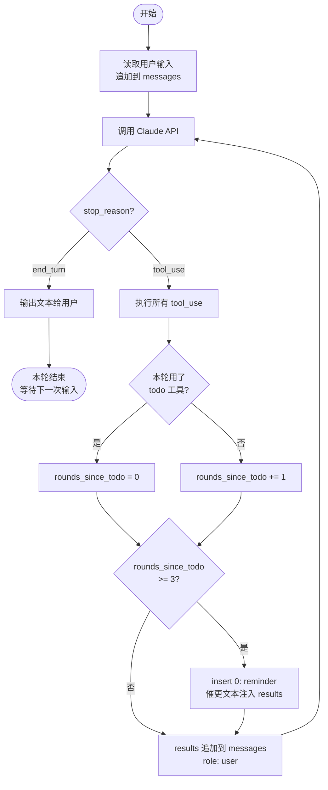

# s03: TodoWrite 知识点

> 格言：*"没有计划的 agent 走哪算哪"*

---

## 核心思想

多步任务里模型会迷失——工具结果不断填满上下文，后续步骤被稀释出注意力，开始跑偏或重复。

解法：给模型一个它自己维护的任务清单 + Harness 催更机制。

本质上是 **ReAct + Plan 复合模式**：
- ReAct = 循环本身（思考 → 调工具 → 看结果 → 再思考）
- Plan = todo 工具（模型自己列步骤、更新状态）

---

## 新增机制

### 1. TodoManager

模型通过调用 `todo` 工具来更新清单，状态三种：

```
[ ] pending      — 还没开始
[>] in_progress  — 正在做（同时只能有一个）
[x] completed    — 做完了
```

**"同时只能一个 in_progress"** 是硬约束，在 `TodoManager.update()` 里执行。原因：
1. **强迫模型专注** — 没有约束模型会把所有任务都标成 in_progress，跳来跳去，哪个都做不完
2. **让状态有意义** — 只允许一个 `[>]`，它就是模型当前注意力的精确定位，一眼看出在干哪步

```python
if in_progress_count > 1:
    raise ValueError("Only one task can be in_progress at a time")
```

如果模型提交了两个 in_progress，`ValueError` 被 except 捕获，转成字符串作为 tool_result 返回给模型。模型看到错误会自己修正。

**Harness 设计原则：不要崩溃，把错误变成反馈。**

### 2. Nag Reminder（催更机制）

Nag 是英文口语"唠叨、催促"——Harness 像个催命鬼，模型一旦忘了更新 todo，就不停提醒它。

```python
rounds_since_todo = 0 if used_todo else rounds_since_todo + 1
if rounds_since_todo >= 3:
    results.insert(0, {"type": "text", "text": "<reminder>Update your todos.</reminder>"})
```

- 模型连续 3 轮没调用 `todo`，Harness 在下一轮的 tool_result 里插一条提醒
- 用 `insert(0, ...)` 插到最前面，让模型第一眼就看到，优先级最高
- 追加到最后会被淹在工具结果里，容易被忽略

**Nag 防止两种情况：**
1. **跑题** — 模型开始做计划外的事
2. **忘记更新状态** — 任务做完了但 todo 还显示 in_progress，下一步规划就乱了

没有 nag，模型在长任务里容易"干活不汇报"，todo 列表变成摆设。

---

## 数据流图

```mermaid
flowchart LR
    U([用户输入]) --> MSG[messages\[\]]
    MSG --> API[Claude API]
    API --> TB[tool_use blocks]
    TB --> RT{路由表<br/>TOOL_HANDLERS}

    RT -->|todo| TM[TodoManager]
    RT -->|其他工具| OT[其他工具函数]

    TM --> TS[(todo 状态<br/>pending/in_progress/completed)]
    TS -->|render| RES[tool_results]
    OT --> RES

    CNT[rounds_since_todo<br/>计数器] -->|>= 3| NAG[Nag Reminder<br/>催更文本]
    NAG -->|insert 0| RES

    RES -->|role: user| MSG

    API -->|end_turn| OUT([输出给用户])
```

---

## 控制流图



---

## 关键细节

### rounds_since_todo 为什么在函数内而不是全局？

定义在 `agent_loop` 函数里，每次调用都从 0 开始，**每个任务独立计数**。

如果放全局：第一个任务做了 5 轮后 `rounds_since_todo = 5`，用户输入第二个任务时计数器不归零，第一轮就立刻触发提醒。

### 提醒怎么传给模型？

提醒插在 `results` 里，以 `role: "user"` 发给模型。模型下一轮读 messages 时自然看到，不需要任何特殊机制。

---

## 加新工具：三步走（来自 s02）

以加 `list_todos` 为例（只读，不修改）：

**第一步：写函数**
```python
def run_list_todos() -> str:
    return TODO.render()
```

**第二步：加进路由表**
```python
TOOL_HANDLERS = {
    ...
    "list_todos": lambda **kw: run_list_todos(),
}
```

**第三步：加 schema**
```python
{"name": "list_todos", "description": "View current todo list without modifying it.",
 "input_schema": {"type": "object", "properties": {}, "required": []}},
```

循环不动，其他地方不动。

---

## 对比 s02

| 组件 | s02 | s03 |
|---|---|---|
| 工具数量 | 4 | 5（+todo）|
| 规划能力 | 无 | TodoManager |
| 循环新逻辑 | 无 | `rounds_since_todo` 计数器 + 提醒注入 |

---

## 下一课预告：s04
大任务拆小，每个小任务干净的上下文。子 Agent 用独立 messages[]，不污染主对话。
