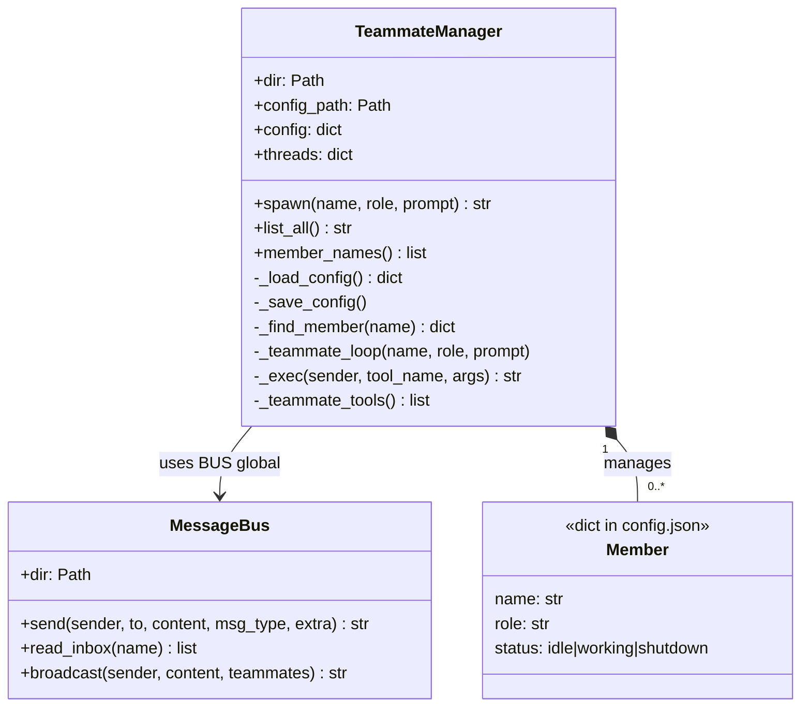
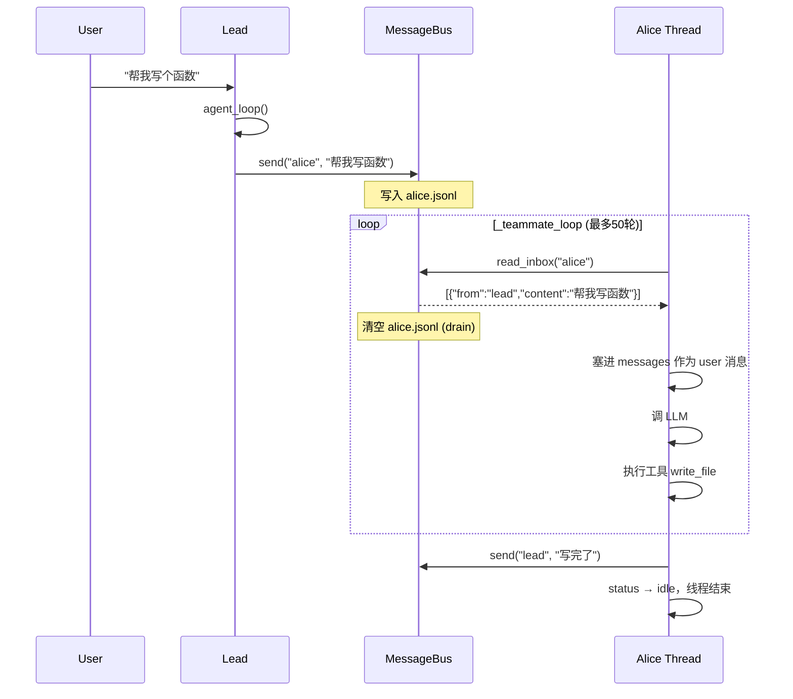

# s09 - Agent Teams（多智能体团队）

## 核心洞见
**不只是并行执行，而是持久存在、能互相通信的 agent 团队。**<br/>
s08 是"一个 agent + 后台任务"，s09 是"多个 agent，每个都活着，通过收件箱传消息"。

---

## Subagent vs Teammate

| | Subagent (s04) | Teammate (s09) |
|---|---|---|
| 生命周期 | spawn → 执行 → 消亡 | spawn → work → idle → work → ... |
| 通信 | 只能向上汇报给父 agent | 可以互相发消息 |
| 上下文 | 任务结束即消失 | 档案持久，但对话历史消失 |
| 类比 | 外卖员（接单送完消失） | 公司同事（一直在，等消息） |

---

## 三个核心组件



**一句话：工头（TeammateManager）管档案和线程，邮件系统（MessageBus）管消息传递。**

---

## 持久化：什么在，什么没

| 数据 | 持久？ | 在哪 |
|---|---|---|
| 身份 name/role | ✅ | config.json |
| 状态 idle/working | ✅ | config.json |
| 写过的文件 | ✅ | 磁盘 |
| 对话历史 messages | ❌ | 线程局部变量，线程死即消失 |

**档案在，记忆没了。** 靠 write_file 写文件传递记忆，不靠 messages。

---

## 数据流：从 lead 发消息到 alice 执行



---

## _teammate_loop 拆解

```python
def _teammate_loop(self, name, role, prompt):
    # 1. 初始化：身份 + 初始任务
    sys_prompt = f"You are '{name}', role: {role}..."
    messages = [{"role": "user", "content": prompt}]
    tools = self._teammate_tools()

    # 2. 最多跑50轮（保险丝，防止失控花 token）
    for _ in range(50):

        # 3. 收邮件，伪装成 user 消息塞进对话
        inbox = BUS.read_inbox(name)   # drain：读完即清空
        for msg in inbox:
            messages.append({"role": "user", "content": json.dumps(msg)})

        # 4. 调 LLM
        response = client.messages.create(...)
        messages.append({"role": "assistant", "content": response.content})

        # 5. 不用工具就退出
        if response.stop_reason != "tool_use":
            break

        # 6. 执行工具，结果追加进 messages
        results = [...]
        messages.append({"role": "user", "content": results})

    # 7. 结束：状态改回 idle
    member["status"] = "idle"
```

---

## read_inbox：drain 模式

```python
def read_inbox(self, name):
    ...
    for line in inbox_path.read_text().strip().splitlines():
        messages.append(json.loads(line))
    inbox_path.write_text("")   # ← drain：读完清空
    return messages
```

**为什么清空？** 不清空的话，下一轮循环会再读一遍旧消息，alice 重复执行同一条指令。

---

## lead vs teammate 的退出机制

| | lead agent_loop | teammate _teammate_loop |
|---|---|---|
| 循环 | `while True` | `for _ in range(50)` |
| 退出 | `return`（回到主循环等用户） | `break`（线程结束） |
| 为什么 | 人类在控制，随时可停 | 无人看管，需要保险丝 |

---

## stop_reason 的4种值

LLM 不需要你赋值，是 Anthropic API 返回的：

| stop_reason | 含义 |
|---|---|
| `"tool_use"` | 我要用工具，给我结果，继续 |
| `"end_turn"` | 我说完了，任务完成 |
| `"max_tokens"` | 超出 token 上限，被截断 |
| `"stop_sequence"` | 遇到预设终止字符串 |

```python
# response 长这样：
Message(
    content=[
        TextBlock(type='text', text='我来帮你'),
        ToolUseBlock(type='tool_use', name='write_file', input={...})
    ],
    stop_reason='tool_use',   # ← API 给的
    usage=Usage(input_tokens=100, output_tokens=50)
)
```

---

## lead 读 inbox 的小瑕疵

```python
# lead 收到 teammate 消息后：
messages.append({"role": "user",      "content": "<inbox>...</inbox>"})
messages.append({"role": "assistant", "content": "Noted inbox messages."})  # 伪造的
# 然后调 LLM → assistant 又回一条
# 结果：assistant 连续两条（不严格符合 user/assistant 交替）
```

这是代码的一个小瑕疵，严格做法应该在伪造的 assistant 后再加一条 user。

---

## 5种消息类型

| 类型 | 用途 |
|---|---|
| `message` | 普通点对点消息 |
| `broadcast` | 群发给所有 teammate |
| `shutdown_request` | 请求优雅关闭（s10） |
| `shutdown_response` | 批准/拒绝关闭（s10） |
| `plan_approval_response` | 批准/拒绝计划（s10） |

---

## s08 → s09 的进化

| | s08 | s09 |
|---|---|---|
| agent 数量 | 1个（主线程） | 多个（每人一个线程） |
| 并发 | 后台任务并行 | agent 之间并行 |
| 通信 | 无 | JSONL 收件箱 |
| 持久化 | tasks dict | config.json + inbox 文件 |
