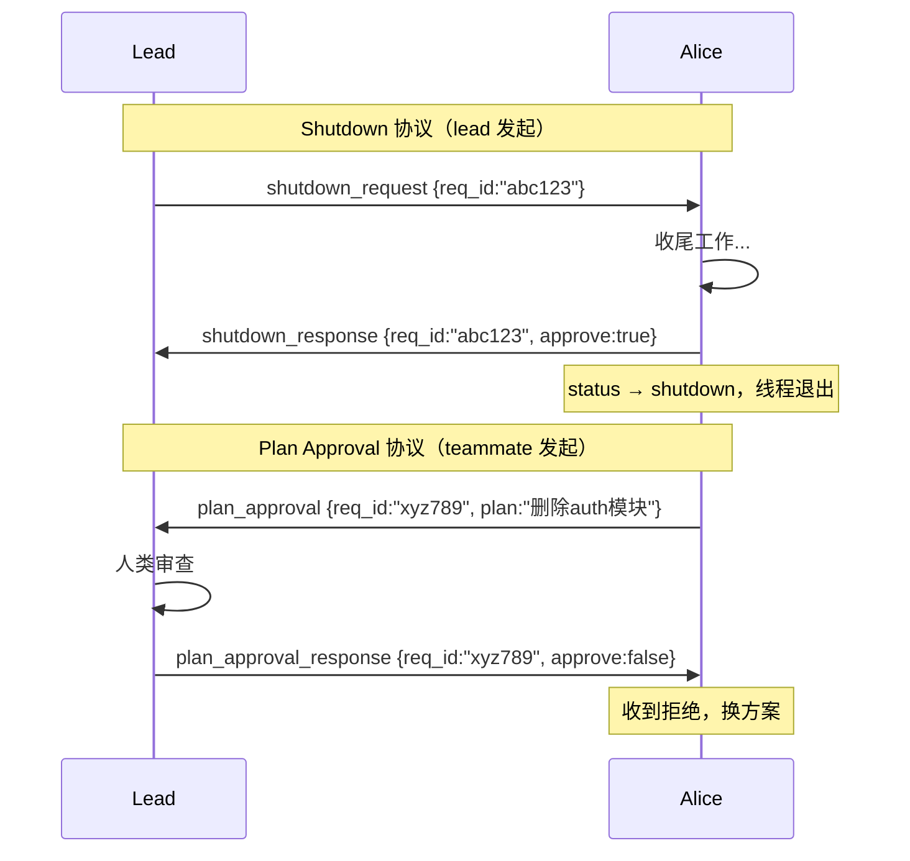
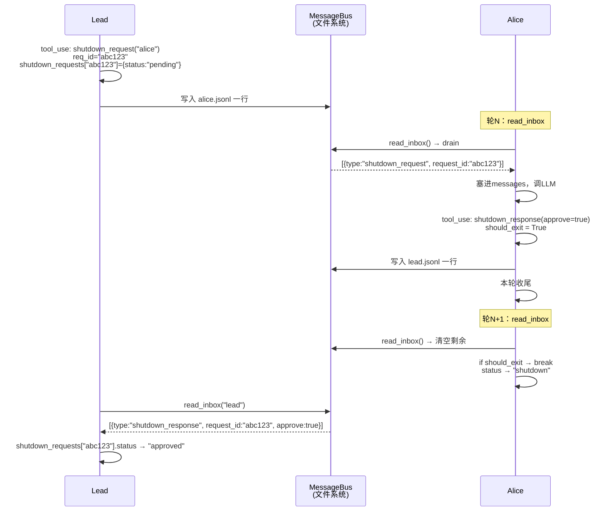
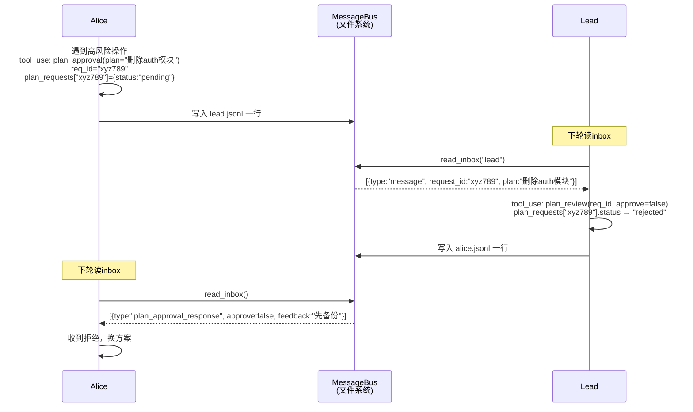

# s10 - Team Protocols（团队协议）

## 核心洞见
**s09 的队友能干活能通信，但没有规矩。s10 加了两个握手协议：关机 + 计划审批。**<br/>
两个协议结构完全一样：一方发带 `req_id` 的请求，另一方引用同一 `req_id` 响应。

---

## s09 的问题

| 问题 | 后果 |
|---|---|
| 直接杀线程关闭 teammate | alice 写到一半的文件损坏 |
| lead 直接下命令 | 高风险操作没人审批，直接执行 |

解决方案：**握手协议**——接收方自己决定什么时候安全。

---

## 两种协议对比



---

## 消息数据结构

`BUS.send()` 把所有字段打包成一个 JSON 对象，追加写入收件箱文件：

```python
msg = {
    "type":      "shutdown_request",   # 消息类型
    "from":      "lead",               # 发送方
    "content":   "Please shut down.",  # 正文
    "timestamp": 1711234567,           # 时间戳
}
# extra 合并进来（不同类型有不同额外字段）
msg.update({"request_id": "abc123"})

# 最终写入 alice.jsonl 一行：
# {"type":"shutdown_request","from":"lead","content":"...","request_id":"abc123",...}
```

**收件箱文件结构：**

```
.team/inbox/
  alice.jsonl   ← alice 的所有来信（不管类型）
  bob.jsonl
  lead.jsonl

alice.jsonl 内容示例：
{"type":"shutdown_request", "from":"lead",  "request_id":"abc123", ...}
{"type":"message",          "from":"bob",   "content":"你写完了吗", ...}
{"type":"broadcast",        "from":"lead",  "content":"今天早下班", ...}
```

`read_inbox()` 一次全取走，根据 `type` 字段判断怎么处理，然后清空文件（drain）。

---

## 两个 Tracker

```python
shutdown_requests = {}
# {"abc123": {"target": "alice", "status": "pending"}}

plan_requests = {}
# {"xyz789": {"from": "alice", "plan": "删除auth模块", "status": "pending"}}
```

**为什么用 dict 不用单个变量？**<br/>
同时关多个人时，用单个变量会互相覆盖。dict 以 `req_id` 为 key，每条请求独立存在。

**FSM（有限状态机）：**
```
pending ──approve──► approved
   └────reject────► rejected
```

---

## should_exit：为什么不直接 break

```python
should_exit = False

for _ in range(50):
    inbox = BUS.read_inbox(name)          # 1. 先读inbox
    for msg in inbox:
        messages.append(...)

    if should_exit:                        # 2. 检查退出标记（在读inbox之后）
        break

    response = client.messages.create(...)

    for block in response.content:
        if block.name == "shutdown_response" and block.input.get("approve"):
            should_exit = True             # 3. 标记，但不立刻退

    messages.append({"role": "user", "content": results})  # 4. 本轮收尾

# 下一轮：读完inbox → if should_exit → break
```

**直接 break 的问题：**
```
轮N：alice 执行 shutdown_response → 立刻 break
     tool_result 还没追加进 messages ← 这步被跳过了
     lead 的响应消息也还没处理
```

**should_exit 的好处：**
```
轮N：执行 shutdown_response → should_exit=True → 本轮收尾完成
轮N+1：读完剩余inbox → if should_exit → break（干净退出）
```

一句话：**先把这轮收尾，再走人。**

---

## 完整数据流：Shutdown



---

## 完整数据流：Plan Approval



---

## s09 → s10 变更

| 组件 | s09 | s10 |
|---|---|---|
| 工具数量 | 9个 | 12个 |
| 关机 | 自然退出/线程死亡 | shutdown_request/response 握手 |
| 计划门控 | 无 | plan_approval + plan_review |
| 请求关联 | 无 | req_id 全程跟踪 |
| FSM | 无 | pending → approved/rejected |
| teammate 退出状态 | idle | idle 或 shutdown（区分正常/协议关闭） |

---

## 工具调用链（LLM 不直接操文件）

```
LLM 决定                    工具函数                    文件系统
───────────────────────────────────────────────────────────────
tool_use: shutdown_request  → handle_shutdown_request() → 写 alice.jsonl
tool_use: shutdown_response → _exec()                   → 写 lead.jsonl
tool_use: plan_approval     → _exec()                   → 写 lead.jsonl
tool_use: plan_review       → handle_plan_review()      → 写 alice.jsonl
```

**LLM 只调工具，工具背后才是 BUS 和 jsonl。** 这是 s02 就定下来的设计，s10 只是工具变多了。
