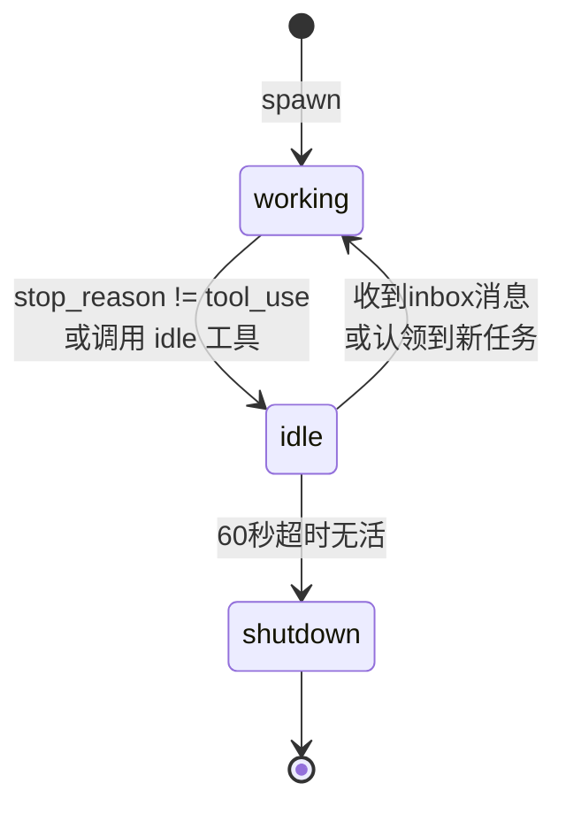

# s11 - Autonomous Agents（自治智能体）

## 核心洞见
**队友自己找活干，不需要 lead 逐个分配。**<br/>
s10 的队友等着被叫，s11 的队友自己扫描任务看板、认领任务、干完再找下一个。

---

## s10 的问题

10个任务 → lead 手动分配10次，扩展不了。

解决方案：**自组织**——队友自己扫描看板，看到没人认领的就上。

---

## WORK / IDLE 两阶段循环

```
s10：干完一个任务 → 结束
s11：干完一个任务 → 找下一个 → 干 → 找下一个 → 干 → ...
```

自然语言伪代码：

```
永远循环：

  【WORK 阶段】
  最多干50轮：
    读一下收件箱，有消息就塞进对话
    叫LLM想一想
    LLM不用工具了 → 跳出50轮
    LLM用了工具 → 执行工具
    LLM主动说"我要休息"(idle工具) → 跳出50轮

  【IDLE 阶段】
  把自己状态改成 idle
  最多等60秒（每5秒检查一次）：
    有人发消息给我？→ 有活了，回去干
    任务看板有没人认领的？→ 我来认领，回去干
    等了60秒还没活 → 关机，退出

  回到顶部，继续WORK
```

---

## 代码结构

```python
def _loop(self, name, role, prompt):
    messages = [{"role": "user", "content": prompt}]  # 只初始化一次，跨任务累积

    while True:                          # 任务之间的循环
        # -- WORK PHASE --
        for _ in range(50):              # 单个任务的上限（保险丝）
            ...调LLM，执行工具...
            if idle_requested: break

        # -- IDLE PHASE --
        self._set_status(name, "idle")
        resume = self._idle_poll(name, messages)
        if not resume:
            self._set_status(name, "shutdown")
            return
        self._set_status(name, "working")
        # 回到 while True 顶部
```

| 循环 | 作用 |
|---|---|
| `while True` | 任务之间的循环，找新活 |
| `for _ in range(50)` | 单个任务的上限，防失控 |

---

## _idle_poll：为什么先查收件箱

```python
for _ in range(60 // 5):   # 12次，每次5秒
    time.sleep(5)

    inbox = BUS.read_inbox(name)    # 1. 先查收件箱
    if inbox: return True

    unclaimed = scan_unclaimed_tasks()  # 2. 再扫任务看板
    if unclaimed:
        claim_task(unclaimed[0]["id"], name)
        return True

return False   # 超时 → 关机
```

**顺序不能反：**

| | 收件箱 | 任务看板 |
|---|---|---|
| 性质 | 定向通信（专门发给你） | 广播式（所有人都能认领） |
| 时效性 | 高（可能是"停下"、"方案有问题"） | 低（等一会儿没关系） |
| 优先级 | 高 | 低 |

**面试术语：**
> 收件箱是 push 模型，任务看板是 pull 模型。系统优先处理 push 事件，避免优先级反转（priority inversion）。

---

## scan_unclaimed_tasks：认领条件

```python
def scan_unclaimed_tasks():
    for f in sorted(TASKS_DIR.glob("task_*.json")):
        task = json.loads(f.read_text())
        if (task.get("status") == "pending"
                and not task.get("owner")       # 没人认领
                and not task.get("blockedBy")): # 没有依赖阻塞
            unclaimed.append(task)
```

三个条件同时满足才能认领：
1. `status == "pending"`
2. 没有 owner
3. 没有 blockedBy（依赖任务还没完成）

---

## 身份重注入

### 触发时机

**只在认领新任务时检查**，不是每次调LLM：

```python
if unclaimed:
    if len(messages) <= 3:          # 检测到压缩
        messages.insert(0, make_identity_block(...))
        messages.insert(1, {"role": "assistant", "content": f"I am {name}. Continuing."})
    messages.append(task_prompt)    # 追加新任务
```

### 为什么 `len(messages) <= 3`

messages 跨任务累积，正常情况越来越长。如果突然变成 2-3 条，说明 Claude API 发生了 context compaction（压缩），历史被替换成 summary。

### 注入了什么

```
messages[0]: user:      "<identity>You are 'alice', role: coder, team: default. Continue.</identity>"
messages[1]: assistant: "I am alice. Continuing."
messages[2]: user:      "<auto-claimed>Task #3: 写单元测试</auto-claimed>"   ← 新任务
```

伪造一个问答对（因为API要求 user/assistant 交替），插在 messages 开头。

### ⚠️ 未解决的问题

系统提示里已经有身份信息：
```python
sys_prompt = f"You are '{name}', role: {role}, team: {team_name}..."
```

系统提示每次调API都传，压缩后也在。**为什么还需要重注入？** 代码和文档里没有明确解释。

可能原因：
- 作者实测发现压缩后系统提示不足以维持身份一致性
- 纯粹的防御性保险

**验证方法**：去掉重注入跑一跑，看压缩后 alice 会不会出问题。

---

## s10 → s11 变更

| 组件 | s10 | s11 |
|---|---|---|
| 工具数量 | 12个 | 14个（+idle, +claim_task） |
| 自治性 | lead 指派 | 自组织 |
| 空闲阶段 | 无 | 轮询收件箱 + 任务看板 |
| 任务认领 | 仅手动 | 自动认领未分配任务 |
| 身份 | 系统提示 | + 压缩后重注入 |
| 超时 | 无 | 60秒空闲 → 自动关机 |

---

## 完整生命周期


