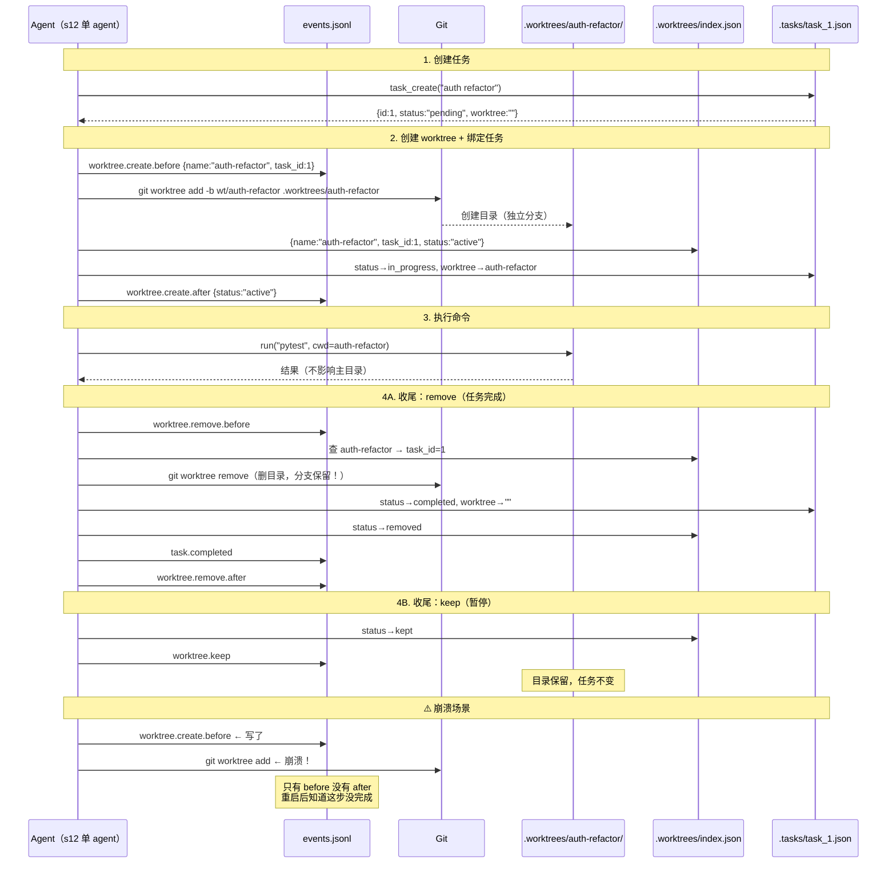
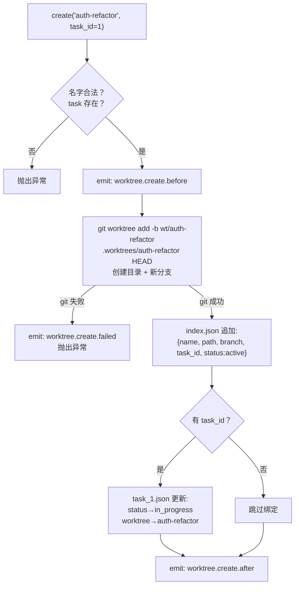
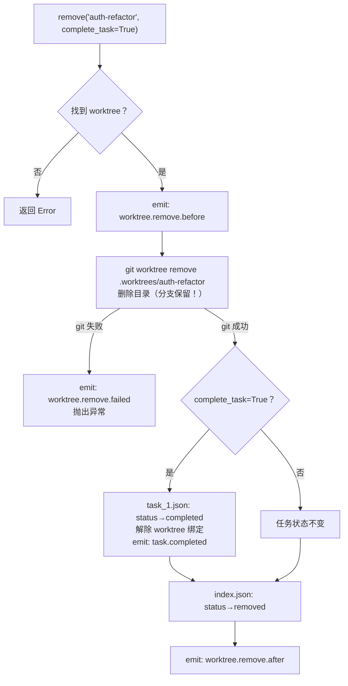
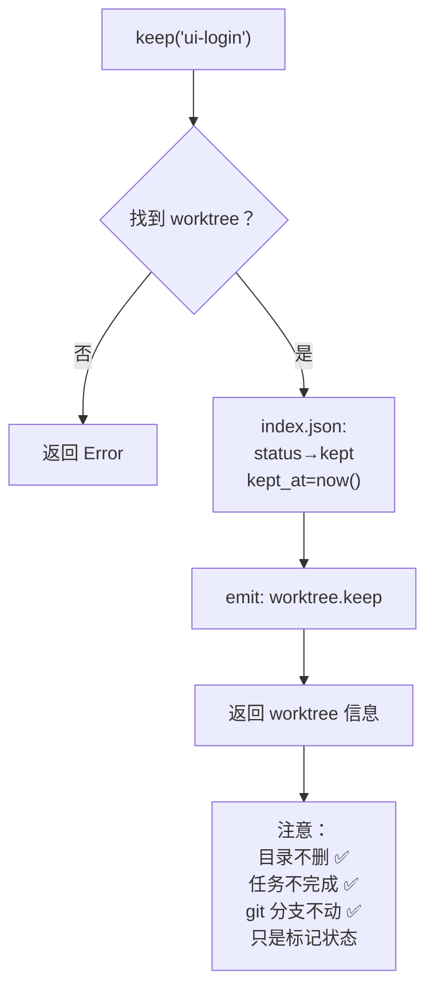
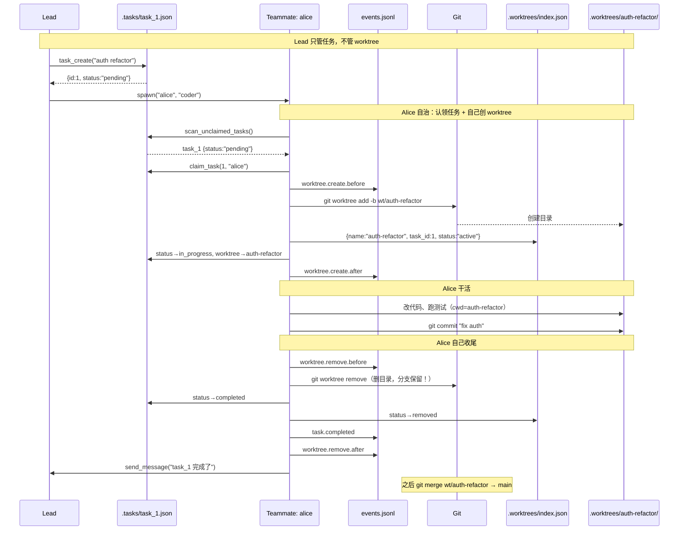

# s12 - Worktree Task Isolation（目录隔离）

## 核心洞见
**任务管"做什么"，worktree 管"在哪做"，用 task_id 绑定两侧。**<br/>
多个 agent 并行干活，每人一个独立目录，互不污染，改完 merge 回主分支。

---

## s11 的问题

```
alice 在改 config.py...
bob   也在改 config.py...  ← 冲突！未提交的改动互相污染
```

解决方案：**git worktree** — 同一个仓库，每个任务一个独立目录，独立分支。

---

## 什么是 git worktree

```
正常情况（一个目录）：          用了 worktree（多个目录）：
my-repo/                       my-repo/           ← main 分支
  config.py                      config.py

                                .worktrees/
                                  auth-refactor/  ← wt/auth-refactor 分支
                                    config.py       alice 在这里改
                                  ui-login/       ← wt/ui-login 分支
                                    config.py       bob 在这里改
```

**三个目录，同一个 `.git`，但每个目录在不同分支上。**<br/>
alice 改她的 `config.py`，完全不影响 bob 的。

---

## 两个平面，一个绑定

```
控制面 Control Plane          执行面 Execution Plane
.tasks/task_1.json            .worktrees/index.json
  id: 1                         name: auth-refactor
  subject: auth refactor        path: .worktrees/auth-refactor/
  status: in_progress    ←→     branch: wt/auth-refactor
  worktree: auth-refactor       task_id: 1
                                status: active
```

- **任务板**：agent 找活、看进度用的
- **worktree 索引**：记录目录在哪、属于哪个任务
- **task_id**：把两侧关联起来的钥匙

---

## 完整生命周期时序图

> ⚠️ s12 只有一个 agent，所以图里 `Agent` 同时扮演 lead 和 teammate 两个角色。真正的完整设计见底部"s12 设计局限"一节。



---

## 核心函数详解

### 1. `WORKTREES.create(name, task_id)`

**自然语言流程：**
先检查名字合不合法、任务存不存在。通过后写一条"即将创建"的事件日志，然后让 git 创建新目录和新分支。创建成功后，把这个 worktree 登记进 index.json，同时更新任务板把任务状态推进到 `in_progress`，最后写"创建成功"事件。任何步骤失败都写"创建失败"事件。



---

### 2. `WORKTREES.remove(name, complete_task=True)`

**自然语言流程：**
先找到这个 worktree 的记录，写"即将删除"事件。然后让 git 删除工作目录（注意：**分支还保留在 git 里**，可以之后 merge）。如果 `complete_task=True`，顺便把绑定的任务标记为 completed，解除绑定。最后更新 index.json 标记为 removed，写"删除成功"事件。



---

### 3. `WORKTREES.keep(name)`

**自然语言流程：**
最简单。找到 worktree，把 index.json 里的状态改成 `kept`，写一条事件日志，返回 worktree 信息。目录不删，任务不完成，只是标记"我知道这个 worktree 留着"。



---

## 三个函数对比

| 函数 | 删目录 | 完成任务 | git 分支 | 事件 |
|---|---|---|---|---|
| `create` | 创建新目录 | pending→in_progress | 创建新分支 | before/after/failed |
| `remove` | ✅ 删除 | ✅（complete_task=True时） | 保留 | before/after/failed + task.completed |
| `keep` | ❌ 保留 | ❌ 不变 | 保留 | worktree.keep |

---

## EventBus：事件流

每个生命周期步骤都写入 `.worktrees/events.jsonl`：

```json
{"event": "worktree.create.before", "ts": 1730000000, "task": {"id": 1}, "worktree": {"name": "auth-refactor"}}
{"event": "worktree.create.after",  "ts": 1730000001, "task": {"id": 1}, "worktree": {"name": "auth-refactor", "status": "active"}}
{"event": "task.completed",         "ts": 1730000002, "task": {"id": 1, "status": "completed"}, "worktree": {"name": "auth-refactor"}}
{"event": "worktree.remove.after",  "ts": 1730000002, "task": {"id": 1}, "worktree": {"name": "auth-refactor", "status": "removed"}}
```

**哪些操作触发 EventBus：**

| 操作 | 触发事件 |
|---|---|
| `worktree_create` | create.before / create.after / create.failed |
| `worktree_remove` | remove.before / remove.after / remove.failed + task.completed |
| `worktree_keep` | worktree.keep |
| `task_create` | ❌ 不触发 |
| `task_update` | ❌ 不触发 |

**为什么 task_create 不需要 EventBus？**<br/>
task_create 只写一个 json 文件，要么写成了要么没写，不存在"写了一半"的问题。<br/>
worktree 操作涉及 **git 命令 + 多个文件同时更新**，中间任何一步崩溃都会留下不一致状态，所以需要 before/after 记录。

**一句话：EventBus 专门记录"多步骤、有副作用、可能中途崩溃"的操作。**

**为什么需要事件流？**<br/>
崩溃后从 `.tasks/` + `index.json` 可以重建当前状态，但不知道**过程**发生了什么。事件流是不可变的历史记录，方便调试和审计。

---

## 并行执行例子

```
alice 做 task_1（auth refactor）        bob 做 task_2（ui login）
.worktrees/auth-refactor/               .worktrees/ui-login/
  config.py  ← alice 在改                config.py  ← bob 在改
  auth.py                                login.py

两份 config.py 完全隔离 ✅

alice 改完提交：
  worktree_remove("auth-refactor", complete_task=True)
  → 目录删了，task_1 → completed
  → git 分支 wt/auth-refactor 还在
  → 手动 git merge wt/auth-refactor → main

bob 没改完，暂停：
  worktree_keep("ui-login")
  → 目录留着，task_2 还是 in_progress
  → 之后继续
```

---

## git worktree 底层机制

**分支、objects、worktree 的关系：**

```
图书馆类比：
  .git/objects/  = 图书馆（永久存所有书的内容）
  分支           = 书签（一张纸条，写着"第42页"，告诉你从哪读）
  worktree 目录  = 书桌（把书借出来摆着看）

书桌收拾了（worktree remove）→ 书还在图书馆，书签还在
下次要看 → 拿书签找到对应页 → 重新借出来摆桌上
```

```
.git/refs/heads/wt/auth-refactor  ← 分支文件，内容只是一行 commit 哈希
.git/objects/a3f8c2d              ← commit，包含文件快照指针
.git/objects/b7e9f1a              ← 文件内容（压缩存储，相同内容只存一次）

.worktrees/auth-refactor/         ← 从 objects 还原出来的真实文件
  config.py                          删了目录，objects 不受影响
```

**为什么删目录数据还在：**
- 只要 commit 过，数据就进了 `.git/objects/`，跟目录无关
- 目录只是临时工作台，commit 是永久存储
- 分支是导航入口，objects 是真正的数据

---

## 面试题解析

### Q1：worktree vs 直接切换分支

`git checkout` 切换分支需要处理未提交改动（commit 或 stash），且同一时间只能在一个分支工作。

worktree 让多个分支**同时存在于不同目录**，agent 并行干活不需要切换，不会互相看到对方未提交的改动。

---

### Q2：控制面和执行面为什么分开

两者生命周期不同步：
- 任务可以没有 worktree（pending 阶段）
- worktree 可以没有任务（纯临时沙盒）
- 任务可以换 worktree（旧目录污染了，重新开一个）

分开设计符合**关注点分离**原则，用 `task_id` 在需要时关联。合并在一起，两边都不干净。

---

### Q3：删目录为什么保留分支

有意的设计，好处：

| 场景 | 没保留分支 | 保留分支 |
|---|---|---|
| 忘记 merge 就 remove | 代码永久丢失 | 从分支找回 |
| 想 review 再 merge | 没法看了 | 随时 merge |
| 误删 worktree | 无法恢复 | 重新挂载 |

> "删目录只是释放磁盘空间，分支是安全网。目录和分支生命周期故意分开管理。"

---

### Q4：两个 agent 改同一个文件怎么办

worktree 只解决**执行时隔离**，不解决 merge 冲突。改进方向：

| 方案 | 原理 | 代价 |
|---|---|---|
| 任务设计划分职责 | 不同任务改不同目录 | 需要 lead 规划好 |
| blockedBy 依赖 | 会冲突的任务串行 | 局部串行，不影响其他并行 |
| 文件级锁 | 改文件前登记，别人跳过 | 实现复杂 |

> "worktree 只解决隔离，merge 冲突要靠任务设计或依赖机制避免。"

---

### Q5：进程崩溃，目录有但 index.json 没记录

**问题根源（原子性问题）：**

```python
self._run_git(["worktree", "add", ...])  # 1. 目录创建了
     ← 崩溃在这里
self._save_index(idx)                    # 2. 没执行到
self.tasks.bind_worktree(task_id, name)  # 3. 没执行到
```

多步操作被打断，状态不一致。

**s12 的解法：events.jsonl WAL（Write-Ahead Log）**

```
操作前写：worktree.create.before
操作后写：worktree.create.after

崩溃恢复时：
  有 before 没有 after → 说明这步没完成
  结合 git worktree list + index.json → 重建一致状态
```

> "这是原子性问题。s12 用 before/after 事件实现 WAL，崩溃后比对事件找到未完成操作，再结合 git 和 index.json 重建一致状态。"

---

## ⚠️ s12 的设计局限 + 完整设计应该长什么样

**s12 的问题：**
图里的 `Agent` 把 lead 和 teammate 的职责混在一起了——因为 s12 只有一个 agent 自己全包，没有真正的多 agent。一个 agent 自己创 worktree 隔离自己，意义不大。

**真正有意义的完整设计 = s11 多 teammate + s12 worktree 隔离：**



**一句话：Lead 只创建任务，Alice 自己认领、自己创 worktree、自己干活、自己收尾，完全自治。**

---

## s11 → s12 变更

| 组件 | s11 | s12 |
|---|---|---|
| 执行范围 | 共享目录 | 每个任务独立目录 |
| 协调方式 | 任务板（owner/status） | 任务板 + worktree 显式绑定 |
| 可恢复性 | 仅任务状态 | 任务状态 + worktree 索引 + 事件流 |
| 收尾 | 任务完成 | keep 或 remove（两种选择） |
| 生命周期可见性 | 无 | events.jsonl 完整记录 |
